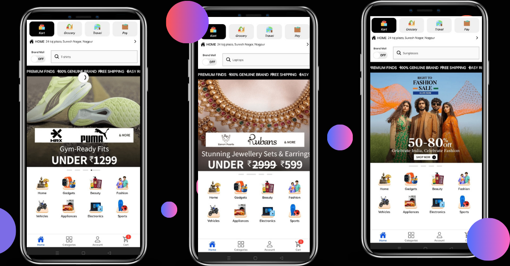
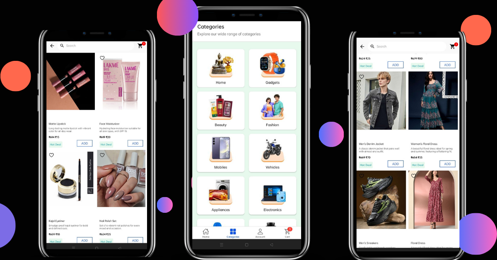
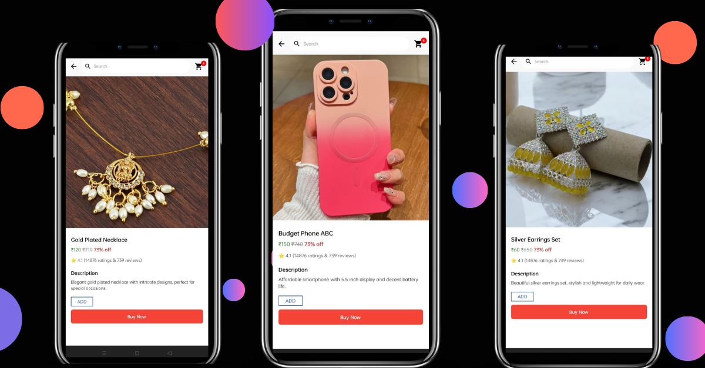
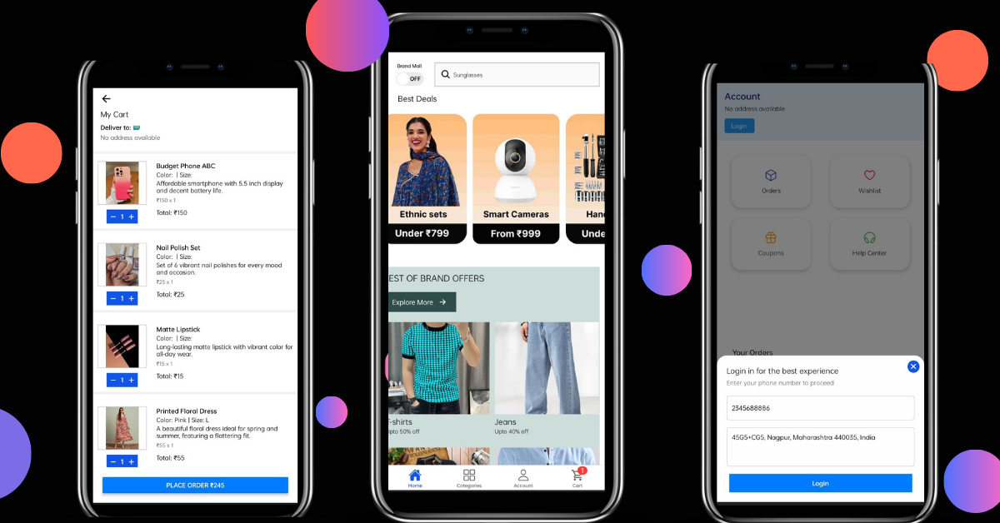

🛒 Flipkart Clone – E-Commerce App (Expo Web)

A Flipkart-inspired E-commerce application built using React Native with Expo Web, featuring product browsing, cart, wishlist, and online payment flow.

///////////////////////////////////

🚀 Features

🏠 Home screen with banners & categories

📦 Product listing & product detail screen

❤️ Wishlist functionality

🛒 Cart management

💳 Online payment flow

📄 Order placement

👤 Account section

🌐 Runs on Expo Web

🎨 Flipkart-style UI

//////////////////////////////////

🛠 Tech Stack
Frontend

React Native

Expo (Web)

TypeScript

Redux Toolkit

React Navigation

Backend

Node.js

Express.js

MongoDB

Razorpay

///////////////////////////////////////////////

## 🖥 App Screenshots

🏠 Home Screen

📂 Categories Screen

📦 Product List Screen

### Product Detail Screen

🛒 Cart Screen

//////////////////////////////////////////////////////////////////////////

⚙️ Run Locally (Expo Web)

git clone https://github.com/Kavita9-git/FlipKart-Clone-Frontend.git

cd FlipKart-Clone-Frontend

npm install

npx expo start --web

